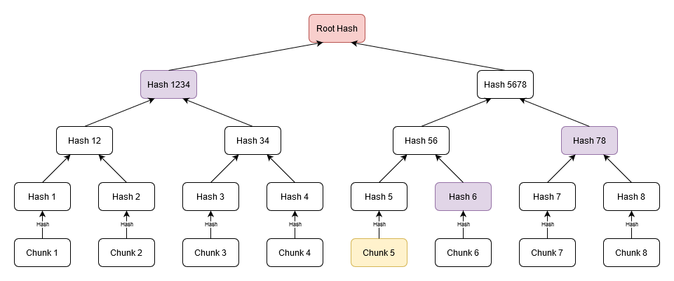

# GENERAL WORKFLOW
https://github.com/cbergoon/merkletree/blob/master/merkle_tree.go

1. Client computes Merkle Tree root hash
2. Client batch upload of files (F0, F1, ..., Fn) into the server
3. (Client deletes all files locally)
4. Client request file i to the server, returns:
   - file i
   - "Merkle proof Pi"
5. Client verifies if file i is tampered, information needed:
   - Root Hash (stored in client)
   - Merkle proof Pi (returned from server)

# MERKLE TREE COMPUTATION

1. Compute hash of each file (H(F0), H(F1), ..., H(Fn))
2. Compute hash of hashes of couples of H(i)-H(i+1)
  - Merkle tree is a slice of slice (n x m)
    - n := number of files
    - m := depth of the tree
    - len(merkleTree[0]) ~~> n
    - len(merkleTree[1]) ~~> n/2
    - len(merkleTree[m-1]) --> 1 (root hash)
    - Note: at each level, if the number of elements is odd you duplicate the last element
3. Reiterate step 2. until you end up into the root hash (no couples)

## Open Questions

- with n even is ok
- with n odd how to behave with the last file?
  - At each level of the tree, if it's odd, then you just copy the last element onto the back of the tree
  ```bash
                            ROOT
                            /  \
                         /        \
                      /              \
                   /                    \
               z1                            z2
             /  \                           / \
           /      \                       /     \
        /            \                /            \
      y1              y2             y3             y3
     /  \            /  \           / \
   /      \        /      \       /     \
  x1      x2      x3      x4     x5    x5
  / \     / \     / \     / \     / \
  a   b   c   d   e   f   g   h   i   i
  ```
- What Merkle Tree function returns?
  - root hash only?
  - store the merkle tree matrix inside the server

# Store Merkle Tree

7. Store Merkle Tree:
   - What the client stores:
     1. Top Hash (Root or Master Hash) (that the client computes itself)
   - What the client gets from the server:
     1. Merkle proof Pi

## Data Structure

Merkle Tree can be represented by a slice of slice (matrix)
of dimension (n x m)

- n := number of files
- m := depth of the tree

merkeTree[0] = [H(0), ..., H(n/2^0 - 1)] --> n elements (n/2^1 elements)
merkeTree[1] = [H(1), ..., H(n/2^1 - 1)] = [H(H(0)+H(1)), H(H(2)+H(3)), ..., H(H(n-2) + H(n-1))] --> n/2 elements (n/2^1 elements)
...
merkeTree[x] = [H(x), ..., H(n/2^x - x)] --> n/2^x elements
merkeTree[m-1] = [] --> 1 element (n/2^m-1 elements) --> the element is the root hash

# Merkle Proof Pi

;
If some client requests the file 5, the peer file server will answer with:

- The file 5 content
- Verification Proofs (Merkle Proof P5): Hash 6, Hash 78 and Hash 1234

How to return the slice with the needed hashes? (the order in the slice is the order of computation to produce the root hash)

initial value of x = file index (e.g. F3 then x = 3)
p := is the slice with the needed hashes to reconstruct the hash root (of size m-1)

0 <= x < n
0 <= y < m-1

Rules:

- if x is even : get x + 1 (P_index_x = x+1)
- if x is odd : get x - 1 (P_index_x = x-1 )

p[y] = Px

X value of next iteration:
x = x/2 (absolute value)

## Examples

### Example always even files

e.g. merkle tree of 8 files (n = 8)
I want file 5 (start counting from 0: F0,F1,...,F7)
initial x = 5
y = 0
5 is odd
p_index[0] = x-1 = 4
p_index[0] = 4
y = 0 is < m-1
y = 1
new x = x/2 = 5/2 = 2
2 is even
p_index[1] = x+1 = 3
p_index[1] = 3
y = 1 is < m-1
y = 2
new x = 2/2 = 1
1 is odd
p_index[2] = x-1 = 1-1 = 0
p_index[2] = 0
y = 2 is not < m-2 (4-2 = 2)

p[0] = merkleTree[0]p_index[0]] = merkleTree[0][4]
p[1] = merkleTree[1]p_index[1]] = merkleTree[1][3]
p[2] = merkleTree[2]p_index[2]] = merkleTree[2][0]

### Example not always even files (odd files)

e.g. merkle tree of 9 files (n = 9)
At each level of the tree, if you have odd elements, you just duplicate the last element with itself and compute the new hash

- If it's odd (at each level of the tree) -> duplicate last element at that level
- if len(merkleTree[i])/2 != 0 {
    merkleTree.append(merkleTree(len -1) )
  }
